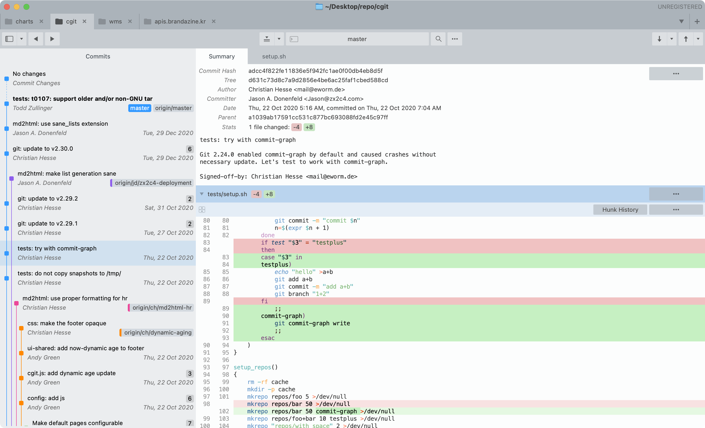
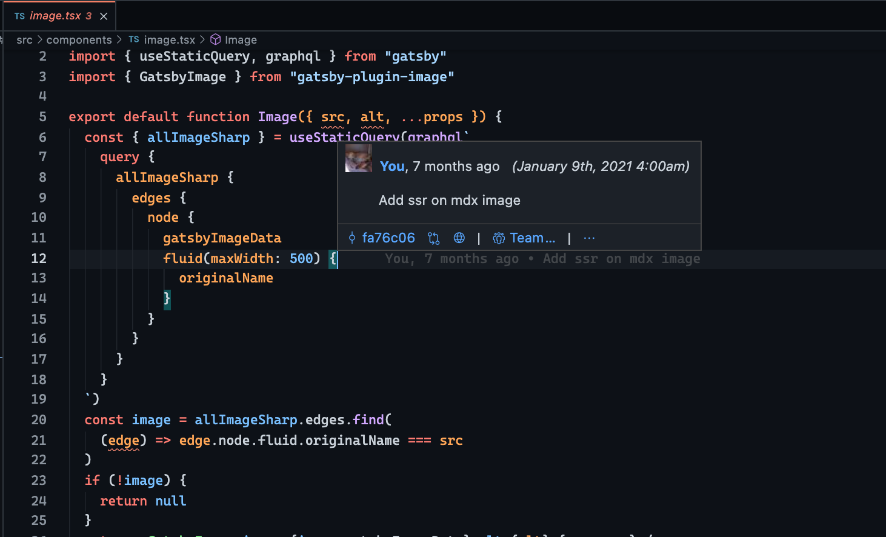
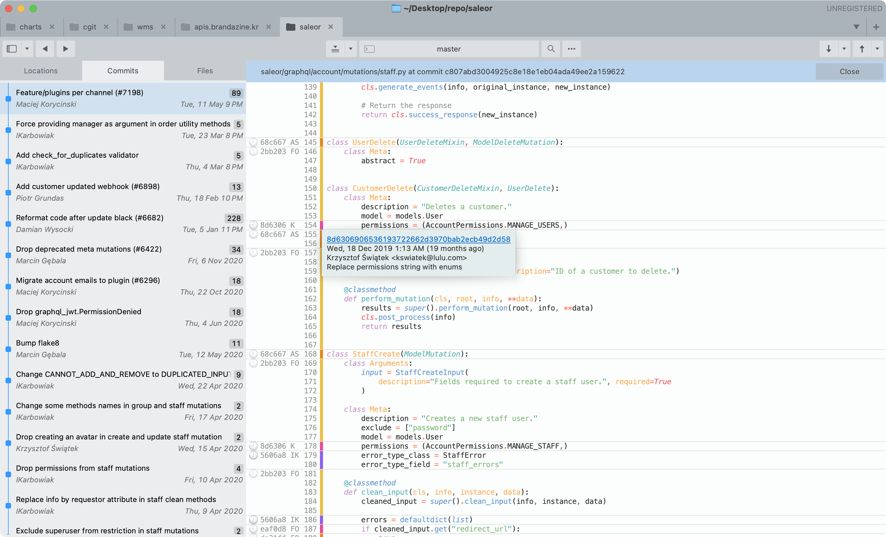

## 서론

git은 만들어질 때부터 대규모 프로젝트를 염두에 둔 협업 툴로서 설계되었다. 이제 git은 소프트웨어 엔지니어 뿐 아니라 코딩과 협업이 필요한 모든 분야에서 필수라고 해도 과언이 아니게 되었다. 여기서 '필수'라 함은 '정말로 필요하다'는 뜻이다. 예를 들어, 어떤 엔지니어가 정말 빠른 코드를 기가 막히게 잘 짠다 해도, git 사용법이 미숙해서 리포지터리를 엉키게 하고 다른 팀원들을 혼란시키거나 잘못된 코드가 배포된다거나 하는 일이 반복된다면, 팀원으로서의 자질이 의심받을 수도 있을 정도로 중요하다는 말이다.

그러나 아직도 많은 사람들이 git을 업무에 도움되게 잘 쓰기 어려워 하고 있다. git 자체가 원래 좀 어렵기도 하거니와 팀마다 git을 사용하는 방식이 너무 다르다. git 리포지터리를 그냥 웹하드나 다름이 없이 사용하는 곳부터 서비스의 라이프사이클에 적극적으로 git의 기능을 활용하는 곳까지 git의 사용자는 상당히 다양한 스펙트럼이 있다. 그러다보니 기본적인 부분을 조금만 벗어난 노하우도 너무나도 다른 환경에서 적용하기가 쉽지 않다.

웹에는 수많은 깃 매뉴얼이 있지만 팀워크와 협업을 위한 노하우 공유는 보기 드물다. 개중에는 뛰어난 튜토리얼도 있고 [pro git](https://git-scm.com/book/ko/v2)처럼 체계적으로 설명되어 있는 자료도 많지만 30분만에 읽고 실제 업무에 적용하기는 힘들다. git의 [공식 문서](https://git-scm.com/docs)는 개별 페이지는 내용이 충실하고 글도 알기 쉬운 좋은 자료이지만 무엇을 알아야 하는지 정확히 알지 못할 때(즉, 업무시간 대부분)에는 별 도움이 안된다. (man page가 흔히들 그렇다)

내가 git을 제대로 배운 곳은 바로 군대 업무에서였는데, 기본적인 명령어만 알고 있던 당시 선임에게 말 그대로 '쪼인트' 까여 가며 협업을 위한 요령을 배웠다. 그래서 아직도 git으로 사고친 걸 몰래 수습하기는 자신있다. 그 경험을 바탕으로 쉽고 보편적인 노하우 몇가지를 공유하려고 한다.

## 도구

도구나 방법론은 각자의 취향과 필요에 따라 다르니 참견하고 싶지 않지만, 혼란을 주고 싶지 않기에 내가 쓰는 도구를 미리 설명하겠다. 나는 git cli(그냥 git)와 git 단축키를 추가해주는 [SCM breeze](https://github.com/scmbreeze/scm_breeze), GUI 툴인 [Sublime Merge](https://www.sublimemerge.com/), VS Code extension인 [GitLens](https://marketplace.visualstudio.com/items?itemName=eamodio.gitlens)를 상황에 맞게 쓰고 있다. 아무래도 터미널 환경은 보여주는 정보의 양에 한계가 있기 때문에 평소에는 Sublime Merge나 IDE에 내장된 git client를 쓰고, cli는 [git rebase -i](https://git-scm.com/book/en/v2/Git-Tools-Rewriting-History#_changing_multiple)처럼 복잡한 작업을 하거나 마우스 쓰기 귀찮을 때만 잠깐잠깐씩 쓰는 편이다.

GUI 프로그램은 [sourcetree](https://www.sourcetreeapp.com/), [GitKraken](https://www.gitkraken.com/), [fork](https://git-fork.com/), [GitHub desktop](https://desktop.github.com/) 등 이것저것 시도해봤지만 다 별로 만족스럽지 않았고, Sublime Merge는 cli만큼 빠르고 쉬워서 지금까지 만족하면서 쓰고 주변에도 적극 추천하고 있다. 프로그램에 메인 뷰가 하나밖에 없다는 점이 특히 마음에 든다. 물론 자기 손에 맞는 게 제일이다. 도구에 lock in 되는게 좋은 건 아니지만 프로페셔널이라면 수단을 가리면 안되니까..!

## git log로 코드 베이스 탐색하기

드디어 새 회사에 입사했다. 온보딩 끝내고 랩탑도 받고 스웩도 한아름 받고... 그리고 코드베이스 접근 권한을 받았다! 무엇을 먼저 봐야 할까? 팀원, 코드... 신입으로서 확인해볼 건 많지만 내가 일하게 될 코드의 git log만으로도 제법 많은 것을 파악할 수 있다.

- git을 잘 쓰는지
- 히스토리 관리는 빡빡한 지 아니면 느슨한 지
- 커밋 메시지는 자세한 편인지
- 브랜치를 많이 치는 편인지
- 커밋이 작은지 큰지
- 핫픽스와 잔 수정이 많은 편인지
- 요즘은 어디를 작업하는지
- 누가 최근에 기여를 많이 했는지

이런 것들로 말미암아 다른 것들도 유추해 볼 수 있다.

- 퇴사율이 높은 편인지
- 팀원들끼리 협업이 많은 편인지
- 팀원들이 코드 퀄리티, 컨벤션, 베스트 프랙티스에 신경쓰는 편인지
- 급한 업무가 많은 편인지
- 주어진 태스크에만 몰입할 수 있는 편인지
- 개발 - 출시 사이클이 잘 지켜지는 편인지

git log는 프로젝트의 얼굴이다. 프로젝트가 잘 관리되었는지는 한 눈에 티가 난다.

## git blame으로 코드가 쓰여진 이유 파악하기

입사하고 첫 번째 태스크가 주어졌다. 간단한 버그를 하나 고치는 것인데, 대부분의 코드는 파악했지만 이해가 안되는 부분이 딱 한 줄 있다. 어떻게 해결해야 할까?

가장 좋은 방법은 당연히 같은 팀 동료에게 물어보는 것이지만 그것이 여의치 않을 때도 있다. 그 경우 [git blame](https://git-scm.com/docs/git-blame)이라는 기능이 있다. 소스 코드의 한 줄 한 줄 누가 언제 어떻게 커밋된 것인지 알려주는 기능이다. 이름(당초 용도?)과는 다르게, 선임자의 어리석음을 비난할 때보다는 그 코드가 어떻게 생겨났는지 맥락을 파악하기 위해 더 자주 쓰인다. 이 기능을 활용하면 이 789번째 줄이 누가 언제 어떤 기능을 만들다가 생긴 건지 알 수가 있다.

주석은 누가 고쳐주지 않으면 언젠가 틀린 내용이 되어버리지만 커밋 히스토리는 항상 코드와 발맞춰 간다. 잘 쓴 커밋 메시지는 주석보다 훨씬 큰 힌트가 된다. 커밋 메시지에 'Fix bug' 'mistake' 뭐 이런 식으로 적어 놓지 말고 되도록 자세히 적어야 하는 이유이기도 하다. 문서쓰기 싫어하고 글쓰기 싫어하는 마음은 모두 같다. 혼자 하는 프로젝트라면 커밋 메시지에 무슨 말을 쓰든 상관 없지만 여러 사람이 볼 코드라면 직업적 소명 의식으로 조금만 더 친절하게 쓰자.

blame 기능을 쓸 때는 커맨드라인보다는 GUI가 훨씬 편하니 명령어에 충분히 익숙해졌다면 GUI에도 도전해 볼 것을 권한다.

## git add -p로 원자적 커밋하기

Git을 단순한 백업 솔루션이라고 생각하게 되면 흔히 저지르는 실수가 [원자적 커밋](https://en.wikipedia.org/wiki/Atomic_commit)을 하지 않는 것이다. '커밋을 어떻게 하든 개인 취향 아니냐'고 항변하는 경우가 아주 간혹 있는데, 절대 아니다. 협업과 히스토리 관리를 위한 프레임워크로서 git의 멘탈 모델을 세우기 위해서는 기본적으로 원자적 커밋을 하지 않으면 안된다. 취향의 문제가 아니라 맞고 틀리고의 문제다.

'원자적'이라는 말은 더 쪼갤 수 없을 정도로 작은 최소한의 단위라는 말이다. 예를 들어 송금을 한다고 치면 여기서 돈을 빼서 저기에 넣는 과정이 반드시 한 번에 처리되어야 한다. 이 둘은 분리되면 안되니까 원자적으로 하나의 트랜잭션으로 묶여야 한다. Git commit도 마찬가지로 원자적이여야 한다. 그러니까, 하나의 커밋에서 라이브러리 버전도 올리고 오타도 고치면 안된다. 오타를 고치는 커밋과 라이브러리 버전을 올리는 커밋은 분리가 되어야 한다. 코드를 쓰다 말고 점심먹으러 가느라 커밋을 일단 하고 돌아와서 마저 작업하고 새로 커밋하는 것도 안된다. 쪼개지면 안되는 하나의 작업을 두개의 커밋으로 쪼개선 안된다. 예를 들어 패키지의 이름을 바꾸는 리팩토링을 했다면 거기에 의존하는 코드는 모두 고쳐서 하나의 커밋으로 만들어야지, 도중에 여러 번 커밋을 하면 원자성을 잃게 된다.

그러나 나도 산만한 편이기 때문에 뭔가를 작업하다가 별 생각 없이 다른 것도 만지고 다시 돌아와서 작업하는 경우가 있다. 그 경우에는 그 동안의 변경사항들을 git add -p 또는 sublime merge의 stage lines를 이용해서 하나씩 잘게 쪼개서 커밋한다. 예를 들어 파일 A를 만지다가 10~20줄에서는 버그를 고치고 21~30줄에서는 리팩토링을 한 경우 21~30줄은 unstaged 상태로 냅둔 채 10~20줄까지만 먼저 add, commit을 한다.

<figure>
<video src="./sublime_add_p.m4v" preload="auto" style="width: 100%;" autoplay playsinline loop muted />
<figcaption>sublime merge에서는 줄 단위로 스테이징하기가 약간 더 편하다</figcaption>
</figure>

### 원자적 커밋을 하면 팀에서는 뭐가 좋은가요?

원자적 커밋은 롤백과 디버깅이 편해지고 CI/CD 구성이 쉬워지는 등 장점밖에 없지만 특히나 팀의 관점에서는 코드리뷰가 수월해진다.

코드 리뷰어는 유닛 테스트와 다르게 사람이기 때문에, 코드가 너무 많이 바뀌면 읽기 힘들어하고 귀찮아 한다. 코드 리뷰를 하는데 해야 하는 태스크랑 별 상관도 없는 부분이 고쳐져 있다면? 예민한 사람이면 짜증낼 수도 있다. 이때 커밋들 사이에 스토리가 있으면 코드 리뷰가 좀더 쉬워질 수 있다. 예를 들어 팀에서 [TDD](https://en.wikipedia.org/wiki/Test-driven_development)를 하고 있다면 테스트 코드를 짠 커밋과 구현 커밋, 리팩토링 커밋이 계속 반복될 것이다. 그런 맥락에서 코드를 읽으면 이해를 도울 수 있다.

내 경우는 작업할 때는 그냥 손 가는대로 리팩토링도 하고 상관없는 부분도 고치고 하다가, 코드 리뷰를 받을 때는 그런 잡 커밋들은 다른 브랜치로 git cherry-pick한 다음에 git rebase -i로 drop하고 커밋 메시지도 약간씩 손본 다음에 리뷰를 받는다. 약간의 배려? 회사마다 다르지만 리뷰어가 자연스럽게 그 정도는 요구하는 경우가 다수인 것 같다.
