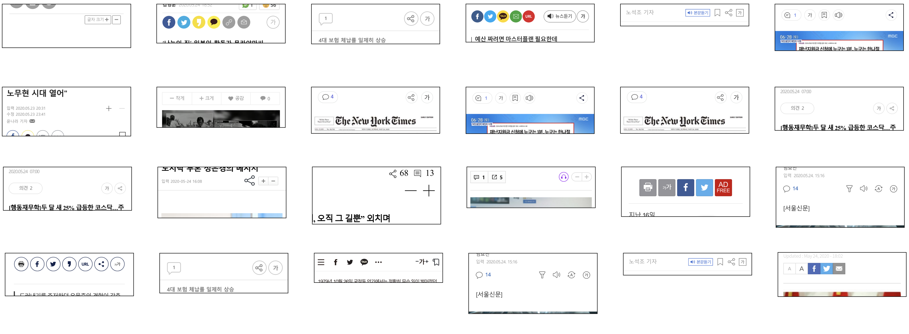

## 개요

서울대학교 디자인학부에서 열리는 '현대디자인론' 과목을 수강하면서 인터넷 저널리즘과 접근성을 개인 프로젝트 주제로 잡았습니다. 언론의 공공성 측면을 테마로 현황조사를 했는데, 고령층의 모바일 사용 습관이 짐작했던 바와 많이 달라서 재미있었는데요. 스마트폰으로 문자, 카톡은 못보내도 뉴스는 꼬박꼬박 보는 사용자가 얼마나 많은지 알면 놀라실걸요?

프로젝트 과정 중에 국내외 인터넷 언론 본문에서 사용되는 스타일 현황 조사를 만들었는데, 누가 이런걸 보겠냐마는 그래도 기껏 만들어놓은 자료니까 공유하려고 합니다. 국내 언론사 중 포털 사이트 메인에 올라가는 경향신문 등 40개소(네이버, 다음 인링크 포함)를 조사했고, 미국 9개소, 일본과 중국 각각 5개소, 4개소를 추가로 확인했습니다.

웹 폰트를 돋움으로 설정한 곳이 두 군데나 있던데 왜 그럴까요...? 돋움이 좋아서?

## 방법

puppeteer로 본문 문단 1개에 내용이 동일한 텍스트를 삽입한 뒤 `font-size`, `font-family`, `line-height`, `word-spacing`, `line-spacing`, 이렇게 5개 스타일의 computed된 값을 구하고 문단을 스크린 샷으로 남겼습니다. 문단 간격, body의 padding 값 등 전체적인 레이아웃이 고려되어 있지 않아 스크린 샷만으로 가독성 등을 평가하는 것은 어렵습니다.

사용된 인터넷 기사와 코드는 부록에 첨부합니다.

## 인터넷 신문 본문 타이포그래피 - 국내

타이포그래피보다도 거의 모든 언론사가 글자 크기 조절 버튼을 상단에 배치하는 등 비슷비슷한 독자적인 접근성 가이드라인을 따른 부분이 눈에 띄었습니다. 외국에서는 WSJ 등을 제외하고는 글자 크기 조절 버튼 등의 도입 사례를 거의 찾아볼 수가 없어 확인해 보니, [웹와치](http://www.webwatch.or.kr/MA/020401.html?MenuCD=240)라는 업체에서 제시한 가이드라인에 명시된 내용이었습니다.



import TypographyCardList from "./typographyCardList"

<TypographyCardList zone="kor"/>

## 인터넷 신문 본문 타이포그래피 - 미국

굉장히 보편화된 paywall과 다양한 웹폰트가 인상적입니다. 한국처럼 폰트 파일 하나가 2MB씩 하는 나라에서는 이렇게 쉽게쉽게 웹 폰트를 쓰지는 못하죠. 아름다운 세리프 폰트로 인터넷 뉴스를 볼 수 있는 것이 부럽네요.
※[정적 사이트에서 한국어 웹 폰트 최적화하기](https://palindrom615.dev/optimizing-web-font)

<TypographyCardList zone="usa"/>

## 인터넷 신문 본문 타이포그래피 - 일본, 중국

<TypographyCardList zone="jpn"/>

<TypographyCardList zone="chn"/>

## 부록

### 코드

[https://github.com/palindrom615/journal-styles-crawler](https://github.com/palindrom615/journal-styles-crawler)

위 리포지터리에 공개했습니다. 한 번 쓰고 버릴 줄 알고 대충 짜서 민망하지만..

```javascript
const puppeteer = require("puppeteer");
const filter = require("async/filter");
const map = require("async/map");
const fs = require("fs").promises;

const device = puppeteer.devices["Galaxy Note 3"];

const EXT = ".usa";

const prefix = new Date().toISOString() + EXT;

const takeScreenshot = async (page, articleTextNodes, journal) => {
  const pageScsh = await page.screenshot({
    path: `${prefix}/${journal}.png`,
    fullPage: true,
  });
  if (!articleTextNodes || !articleTextNodes[1]) {
    console.log(`${journal} no article TextNodes`);
    return;
  }
  const typeScsh = await articleTextNodes[1]
    .evaluateHandle((node) => {
      const p = node.parentNode;
      const pp = node.parentNode.parentNode;

      p.textContent =
        "Lorem ipsum dolor sit amet, consectetur adipiscing elit, sed do eiusmod tempor incididunt ut labore et dolore magna aliqua. Ut enim ad minim veniam, quis nostrud exercitation ullamco laboris nisi ut aliquip ex ea commodo consequat. Duis aute irure dolor in reprehenderit in voluptate velit esse cillum dolore eu fugiat nulla pariatur. Excepteur sint occaecat cupidatat non proident, sunt in culpa qui officia deserunt mollit anim id est laborum.";
      return p;
    })
    .then(async (handle) => {
      try {
        return await handle
          .asElement()
          .screenshot({ path: `${prefix}/${journal}-type.png` });
      } catch (e) {
        console.log(e, await handle.evaluate((node) => node.innerHTML));
      }
    });
  return;
};

const getInfo = async ([journal, url], browser) => {
  const page = await browser.newPage();
  await page.emulate(device);
  page.on("console", (msg) => {
    for (let i = 0; i < msg._args.length; ++i)
      console.log(`${journal}: ${msg._args[i]}`);
  });
  try {
    await page.goto(url, {
      waitUntil: "networkidle2",
      timeout: 0,
    });
  } catch (e) {
    console.log("19:page goto error: ", e, journal, url);
    return;
  }

  const textNodes = await page.$x(
    "//text()[not(parent::script|parent::style|parent::noscript) and string-length() > 80]"
  );

  const articleTextNodes = await filter(textNodes, async (elemHandle) => {
    return elemHandle.evaluate((elem) => {
      return (
        elem.wholeText.trim().split(" ").length > 40 &&
        getComputedStyle(elem.parentNode).getPropertyValue("display") !== "none"
      );
    });
  });

  const textStylePromises = map(articleTextNodes, async (elemHandle) => {
    return elemHandle.evaluate((elem) => {
      // find second paragraph over 30 words.
      try {
        style = getComputedStyle(elem.parentNode || elem);
      } catch (e) {
        console.log("36:getComputedStyle error: ", e, location.href);
        return;
      }
      return {
        txt: elem.wholeText,
        fontSize: style.getPropertyValue("font-size"),
        fontFamily: style.getPropertyValue("font-family"),
        lineHeight: style.getPropertyValue("line-height"),
        letterSpacing: style.getPropertyValue("letter-spacing"),
        wordSpacing: style.getPropertyValue("word-spacing"),
      };
    });
  });
  await takeScreenshot(page, articleTextNodes, journal);

  return textStylePromises;
};

(async () => {
  await fs.mkdir(prefix);

  const journals = (await fs.readFile(`./journals${EXT}`, "utf8"))
    .trim()
    .split("\n")
    .filter((str) => !str.startsWith("//"))
    .map((str) => str.split(","))
    .filter((arr) => arr.length === 2 && arr[1] !== "");

  const browser = await puppeteer.launch();

  const results = await map(journals, async (journal) =>
    getInfo(journal, browser)
  );
  const resultsJson = results.map((textStyle, journalIdx) => {
    return {
      journal: journals[journalIdx][0],
      site: journals[journalIdx][1],
      ...textStyle[1],
    };
  });
  await browser.close();

  await fs.writeFile(`${prefix}/result.json`, JSON.stringify(resultsJson));
  return;
})();
```

### 기사 목록

* 경향신문, https://m.khan.co.kr/view.html?art_id=202005241133001
* 국민일보, http://m.kmib.co.kr/view.asp?arcid=0014613117&code=61121111&sid1=soc
* 노컷뉴스, https://m.nocutnews.co.kr/news/5348747
* 뉴데일리, http://www.newdaily.co.kr/site/data/html/2020/05/24/2020052400023.html
* 뉴스타파, https://newstapa.org/article/5MKIu
* 뉴시스, https://mobile.newsis.com/view.html?ar_id=NISX20200524_0001035097&cID=&pID=00
* 데일리안, https://www.dailian.co.kr/mobile/news/view/892210
* 동아일보, https://www.donga.com/news/Inter/article/all/20200524/101189408/1?ref=main
* 디지털타임스, http://m.dt.co.kr/contents.html?article_no=2020052502100351062001
* 마이데일리, http://m.mydaily.co.kr/new/read.php?newsid=202005222045313449
* 매일경제, https://m.mk.co.kr/news/economy/view/2020/05/530585/
* 머니투데이, https://m.mt.co.kr/renew/view.html?no=2020052214235482190
* 문화일보, http://m.munhwa.com/mnews/view.html?no=20200524MW075540143906
* 미디어오늘, http://www.mediatoday.co.kr/news/articleView.html?idxno=207233
* 블로터, http://www.bloter.net/archives/382430
* 서울경제, https://m.sedaily.com/NewsView/1Z2VJ1J41K
* 서울신문, http://m.seoul.co.kr/news/newsView.php?id=20200525001002&cp=seoul&m_sub=msub_seoul_111&wlog_tag1=mb_seoul_from_index
* 세계일보, http://m.segye.com/view/20200524505973
* 시사인, https://www.sisain.co.kr/news/articleView.html?idxno=41965
* 아시아경제, https://cm.asiae.co.kr/article/2020052417373203232
* 아이뉴스24, http://m.inews24.com/v/1267344
* 연합뉴스, https://m.yna.co.kr/view/AKR20200524032751530
* 오마이뉴스, http://m.ohmynews.com/NWS_Web/Mobile/at_pg.aspx?CNTN_CD=A0002643294&CMPT_CD=MTO99
* 이데일리, https://m.edaily.co.kr/amp/read?newsId=02043446625772200&mediaCodeNo=257
* 조선일보, https://m.chosun.com/svc/article.html?sname=news&contid=2020052401911
* 중앙일보, https://mnews.joins.com/article/23784283?cloc=joongang-mhome-Group1
* 코리아헤럴드, http://m.koreaherald.com/view.php?ud=20200524000204
* 파이낸셜뉴스, https://m.fnnews.com/news/202005241752436602
* 프레시안, https://m.pressian.com/m/pages/articles/2020052417063804969
* 한겨레, http://m.hani.co.kr/arti/international/international_general/946257.html
* 한국경제, https://www.hankyung.com/economy/article/2020052402761
* 한국일보, http://m.hankookilbo.com/News/Read/202005241721373763?did=PA&dtype=3&dtypecode=5380
* jtbc, http://mnews.jtbc.joins.com/News/Article.aspx?news_id=NB11951850
* kbs, http://mn.kbs.co.kr/mobile/news/view.do?ncd=4453411
* mbc, https://imnews.imbc.com/replay/2020/nwtoday/article/5783103_32531.html?utm_source=dable
* mbn, https://m.mbn.co.kr/news/society/4160671
* sbs, https://mnews.sbs.co.kr/news/endPage.do?newsId=N1005801961&plink=SBSAPP&plink=SBSAPP
* ytn, https://m.ytn.co.kr/news_view.php?key=202005241950464452&s_mcd=0103
* 다음, https://news.v.daum.net/v/20200621224825435
* 네이버, https://news.naver.com/main/read.nhn?mode=LSD&mid=shm&sid1=104&oid=001&aid=0011630435
* usatoday, https://www.usatoday.com/story/news/health/2020/05/24/coronavirus-news-veterans-who-died-covid-19-honored-photos/5243891002/
* wsj, https://www.wsj.com/articles/u-s-marks-memorial-day-weekend-as-coronavirus-death-toll-nears-100-000-11590312043?mod=mhp
* nyt, https://www.nytimes.com/2020/05/24/us/politics/trump-2020-election-voting-rights.html?action=click&module=Top%20Stories&pgtype=Homepage
* lat, https://www.latimes.com/california/story/2020-05-23/l-a-county-reports-progress-in-coronavirus-fight-as-hospitalizations-drop-fewer-people-test-positive
* nypost, https://nypost.com/2020/05/24/swim-party-contributes-to-second-peak-in-arkansas-coronavirus/
* nydaily, https://www.nydailynews.com/coronavirus/ny-coronavirus-20200523-4un7kk74x5a23pmtjfyq45mmo4-story.html
* wp, https://www.washingtonpost.com/politics/the-pandemic-has-already-altered-how-tens-of-millions-of-americans-can-cast-their-ballots-this-year/2020/05/23/0e3c3bf8-9532-11ea-91d7-cf4423d47683_story.html?hpid=hp_hp-banner-main_virusvoting740pm%3Ahomepage%2Fstory-ans&itid=hp_hp-banner-main_virusvoting740pm%3Ahomepage%2Fstory-ans
* tribune, https://www.chicagotribune.com/politics/ct-chicago-casino-legislation-20200523-c5sem6ajmrgspme53h2mzgo4gy-story.html
* azcentral, https://www.azcentral.com/story/news/local/arizona-wildfires/2020/05/23/5-juveniles-suspected-starting-park-fire-bagdad/5251919002/
* 요미우리, https://www.yomiuri.co.jp/national/20200621-OYT1T50018/
* 아사히, https://www.asahi.com/articles/ASN6N54S3N6HUPQJ006.html?iref=comtop_favorite_01
* 마이니치, https://mainichi.jp/articles/20200524/k00/00m/040/129000c
* 니케이, https://r.nikkei.com/article/DGXMZO59507450U0A520C2FF8000?s=5
* 추니치, https://www.chunichi.co.jp/article/75952?rct=economics
* 참고소식, http://m.cankaoxiaoxi.com/china/20200524/2411254.shtml?fr=mb
* 인민일보, http://politics.people.com.cn/n1/2020/0524/c1001-31721505.html
* 양쯔만보, http://www.yangtse.com/zncontent/539187.html
* 광주일보, https://www.gzdaily.cn/amucsite/pad/index.html#/detail/1274314